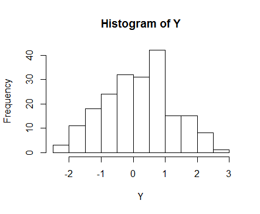
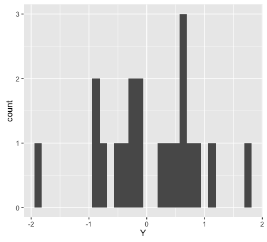
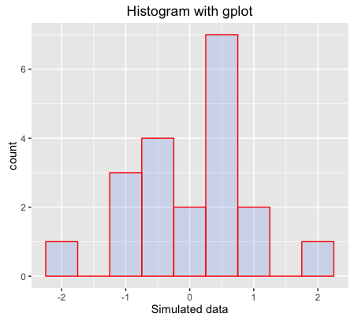
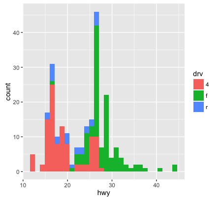
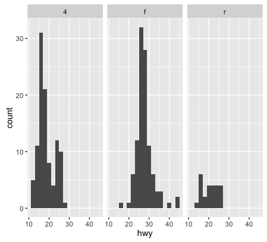

## Making histogram

All scripts are also in **plots_histogram.R** ([GitHub link](https://github.com/weitingwlin/r-primers/blob/master/R_files/plots_histogram.R))

Making histograms using base plot system and _ggplot2_. 

### 1. data
For this example we will use [simulated random numbers](Simulation_random.md).

      set.seed(12345) # to ensure reproducibility
  	  Y <- rnorm(200)

  
### 2. Using base plotting system :
plot histogram in a line
  
    hist(Y)
    
    
   
or save it in a new variable, and plot it later using `plot` function

    Yhist <- hist(Y) # will not make the plot now
    Yhist # see what it looks like

and get some more control:
  
    Yhist$xname <- 'simulation'
    plot(Yhist) # plot again, see what's changed
    
c
        
### 3. using ggplot2: qplot
Load the [package _ggplot2_](https://cran.r-project.org/web/packages/ggplot2/index.html) (please [install the package](https://github.com/weitingwlin/r-primers/blob/master/Documents/Packages.md#download-and-install-packages) if you haven't):

    #      install.packages("ggplot2")
    library(ggplot2)
    
Using the function `qplot` (quick plot)

    qplot(Y)
    
    
    
Note that `qplot` decided this would be a historgram, and make the plot using all [default arguments](Functions_use.md).

If we don't like the default settings, we can add arguments.

Control bin width

    qplot(Y,  binwidth = 0.5)

More comtrol

    qplot(Y,
          geom="histogram",
          binwidth = 0.5,  
          main = "Histogram with gplot", 
          xlab = "Simulated data", 
          fill=I("cornflowerblue"), 
          col=I("red"), 
          alpha=I(.2))

### 4. Histogram with data.frame
`mgp` is a built in data set of ggplot2 package.

Use the function `str` to see what `mpg` looks like

      str(mpg)  

We can color-code our histogram with another variable

      qplot(hwy, data = mpg, fill = drv)
      

Note that `qplot(mpg$hwy, fill = mpg$drv)` will do similar thing, but see what is the difference?    

Or plot each subsets in **facet** (or, subplots)   
 
      qplot(hwy,	
            data = mpg,	
            facets = drv~.,	
            binwidth = 2) 	
            

The argument `facet` dictates the direction of the subplots. 
    
      qplot(hwy, data =	mpg, 
            facets=. ~ drv,	
            binwidth = 2)
    
    