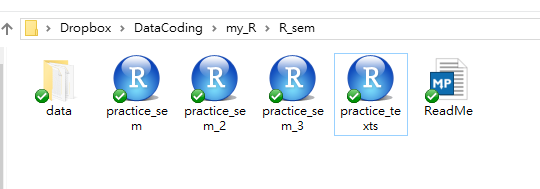

## Set up working environment

Give each project a folder (or "directory"), let's call it  **project folder**. In the folder, there should be a **ReadMe file** (e.g. ReadMe.md) that keeps a record for all the rest files and folders.

**Data** can be put in a seperate folder (maybe called "data").

The **R scripts** (.R files) will be kept in this project folder. 

* make each script small
* use [**relative path**](https://support.dtsearch.com/webhelp/dtsearch/relative_paths.htm) to get data 

## Working with multiple machine
On different machines (either you are synching Dropbox, or flash drive ect.) the project folder might be on different **absolute path**s. So we need a script to set up machine-specific path.

The file **set_path.R** ([GitHub link](https://github.com/weitingwlin/r-primers/blob/master/R_files/set_path.R)) is an example of this script. 

### Elements in  _set\_path.R_
##### setwd
The function `setwd` set the working directory to assigned path.

For example: 
	
	setwd("C:/Users/Wei-Ting/Dropbox")
##### getwd
To check current working directory.

	getwd()

Once you are working in the project folder, you can open or run a file with commends. 

##### if, else, control loop

